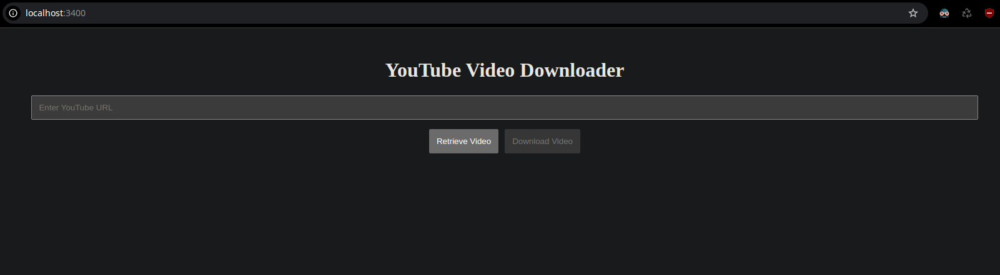

# yt-booster

### an extremely minimalist frontend for yt-dlp, written for bun.



`dlp.ts` - uses bun shell to execute dlp with request parameters passed to an http server (bun serve). also serves static frontend.

`ui/index.html` - static root we can serve with Bun.serve. runs ui/frontend.jsx

`ui/frontend.jsx` - renders `App.jsx`

`ui/App.jsx` - the actual page

## Requirements

you need these binaries on your $PATH:

- `bun`
- `yt-dlp`

## Usage

```
git clone https://github.com/rconjoe/yt-booster
cd yt-booster
bun install
bun run index.ts
```

app will be served on `localhost:3400`.
